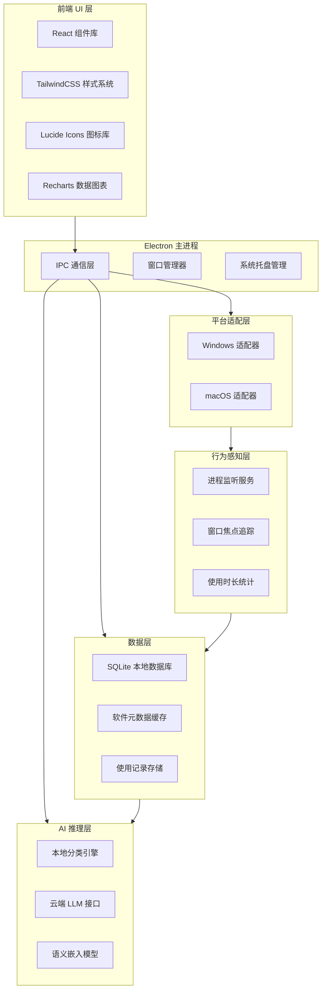

# SoftDesk 技术架构文档

## 1. 架构设计概览

SoftDesk 采用 Electron 跨平台桌面应用框架，前端使用 React + TailwindCSS 构建现代化 UI，后端利用 Node.js 原生能力实现系统级功能。

### 1.1 技术架构分层



### 1.2 目录结构

```
softdesk/
├── src/
│   ├── main/                    # Electron 主进程
│   │   ├── index.ts             # 入口文件
│   │   ├── ipc/                 # IPC 通信处理
│   │   │   ├── software.ts      # 软件扫描相关
│   │   │   ├── usage.ts         # 使用追踪相关
│   │   │   └── launch.ts        # 软件启动相关
│   │   ├── platform/            # 平台适配
│   │   │   ├── windows.ts       # Windows 实现
│   │   │   └── macos.ts         # macOS 实现
│   │   ├── services/            # 核心服务
│   │   │   ├── scanner.ts       # 软件扫描服务
│   │   │   ├── classifier.ts    # AI 分类服务
│   │   │   ├── monitor.ts       # 行为监控服务
│   │   │   └── database.ts      # 数据库服务
│   │   └── tray.ts              # 系统托盘
│   │
│   ├── renderer/                # React 渲染进程
│   │   ├── App.tsx              # 根组件
│   │   ├── components/          # UI 组件
│   │   │   ├── Sidebar/         # 侧边栏
│   │   │   ├── SoftwareGrid/    # 软件卡片网格
│   │   │   ├── SearchBar/       # 搜索框
│   │   │   ├── StatsPanel/      # 统计面板
│   │   │   └── UninstallList/   # 卸载列表
│   │   ├── pages/               # 页面
│   │   │   ├── Dashboard/       # 工作台首页
│   │   │   ├── AllSoftware/     # 全部软件
│   │   │   ├── Statistics/      # 统计分析
│   │   │   └── Settings/        # 设置页面
│   │   ├── hooks/               # 自定义 Hooks
│   │   ├── stores/             # 状态管理
│   │   └── styles/             # 全局样式
│   │
│   └── shared/                  # 共享类型定义
│       └── types.ts             # TypeScript 类型
│
├── public/                      # 静态资源
│   └── assets/                  # 图片资源
│
├── electron-builder.json        # 打包配置
├── package.json
├── tsconfig.json
├── tailwind.config.js
└── vite.config.ts
```

---

## 2. 技术选型

### 2.1 核心技术栈

| 技术 | 版本 | 用途 |
|------|------|------|
| Electron | ^28.0.0 | 跨平台桌面应用框架 |
| React | ^18.2.0 | UI 组件库 |
| TypeScript | ^5.3.0 | 类型安全 |
| Vite | ^5.0.0 | 构建工具 |
| TailwindCSS | ^3.4.0 | 原子化 CSS |
| better-sqlite3 | ^9.0.0 | 本地数据库 |
| Lucide React | ^0.300.0 | 图标库 |
| Recharts | ^2.10.0 | 数据图表 |
| electron-store | ^8.1.0 | 配置存储 |

### 2.2 AI 能力

| 能力 | 实现方式 | 说明 |
|------|---------|------|
| 软件分类 | 云端 LLM API | GPT-4 / Claude / DeepSeek，按软件名称调用 |
| 自然语言搜索 | 云端 LLM API | 将用户查询转为软件属性匹配 |
| 本地离线模式 | 本地嵌入模型（可选） | ONNX 量化模型，<50MB，支持离线分类 |

---

## 3. 路由设计

| 路由 | 页面 | 功能 |
|------|------|------|
| `/` | 工作台首页 | AI 分类展示 + 使用概览 + 快捷启动 |
| `/all` | 全部软件 | 所有软件列表，支持筛选排序 |
| `/category/:name` | 分类页面 | 按分类展示软件 |
| `/stats` | 统计分析 | 使用时长图表 + 数据看板 |
| `/uninstall` | 卸载管理 | 可卸载软件列表 + 批量操作 |
| `/settings` | 设置页面 | 基本设置 + AI 模式 + 隐私选项 |

---

## 4. IPC 通信接口

### 4.1 主进程 → 渲染进程

| 通道 | 用途 | 数据格式 |
|------|------|---------|
| `software:scanned` | 软件扫描完成 | `Software[]` |
| `software:classified` | AI 分类完成 | `Category[]` |
| `usage:updated` | 使用数据更新 | `UsageRecord[]` |
| `app:error` | 应用错误 | `{ code, message }` |

### 4.2 渲染进程 → 主进程

| 通道 | 用途 | 参数 |
|------|------|------|
| `software:scan` | 触发软件扫描 | 无 |
| `software:launch` | 启动软件 | `(path: string, softwareId?: string)` |
| `software:search` | 自然语言搜索 | `{ query: string }` |
| `usage:getStats` | 获取使用统计 | `period: 'day' \| 'week' \| 'month'` |
| `uninstall:execute` | 执行卸载 | `{ paths: string[] }` |
| `settings:update` | 更新设置 | `{ key: string, value: any }` |

---

## 5. 数据模型

### 5.1 数据实体

```typescript
// 软件实体
interface Software {
  id: string;                    // 唯一标识
  name: string;                   // 软件名称
  path: string;                   // 可执行文件路径
  icon: string;                   // 图标路径/base64
  category: string;               // AI 分类名称
  version?: string;               // 版本号
  publisher?: string;             // 发行商
  size?: number;                  // 安装大小(bytes)
  installDate?: string;           // 安装日期
  lastUsed?: string;              // 最后使用时间
  launchCount: number;            // 启动次数
  totalUsageTime: number;         // 累计使用时长(秒)
}

// 使用记录
interface UsageRecord {
  softwareId: string;
  date: string;                  // YYYY-MM-DD
  launchCount: number;
  usageTime: number;              // 秒
  sessions: Session[];            // 使用时段
}

// 使用时段
interface Session {
  startTime: string;             // ISO 时间
  endTime: string;
  duration: number;              // 秒
}

// AI 分类
interface Category {
  id: string;
  name: string;                  // 分类名称
  icon: string;                  // 分类图标
  color: string;                 // 分类颜色
  softwareIds: string[];          // 该分类下的软件ID
  order: number;                 // 显示顺序
}

// 用户设置
interface Settings {
  theme: 'dark' | 'light' | 'system';
  startWithSystem: boolean;       // 开机启动
  runInBackground: boolean;       // 后台运行
  aiMode: 'cloud' | 'local' | 'off'; // AI 模式
  idleThreshold: number;         // 空闲阈值(秒)，超过后暂停计时
  zombieDays: number;            // 僵尸软件判定天数
}
```

### 5.2 数据库表结构

```sql
-- 软件表
CREATE TABLE software (
  id TEXT PRIMARY KEY,
  name TEXT NOT NULL,
  path TEXT UNIQUE NOT NULL,
  icon TEXT,
  category TEXT DEFAULT '未分类',
  version TEXT,
  publisher TEXT,
  size INTEGER,
  install_date TEXT,
  created_at TEXT DEFAULT CURRENT_TIMESTAMP,
  updated_at TEXT DEFAULT CURRENT_TIMESTAMP
);

-- 使用记录表
CREATE TABLE usage_records (
  id INTEGER PRIMARY KEY AUTOINCREMENT,
  software_id TEXT NOT NULL,
  date TEXT NOT NULL,
  launch_count INTEGER DEFAULT 0,
  usage_time INTEGER DEFAULT 0,
  FOREIGN KEY (software_id) REFERENCES software(id),
  UNIQUE(software_id, date)
);

-- 使用时段表
CREATE TABLE sessions (
  id INTEGER PRIMARY KEY AUTOINCREMENT,
  software_id TEXT NOT NULL,
  date TEXT NOT NULL,
  start_time TEXT NOT NULL,
  end_time TEXT,
  duration INTEGER DEFAULT 0,
  FOREIGN KEY (software_id) REFERENCES software(id)
);

-- 分类表
CREATE TABLE categories (
  id TEXT PRIMARY KEY,
  name TEXT NOT NULL UNIQUE,
  icon TEXT,
  color TEXT,
  display_order INTEGER DEFAULT 0
);

-- 设置表
CREATE TABLE settings (
  key TEXT PRIMARY KEY,
  value TEXT
);

-- 索引
CREATE INDEX idx_usage_date ON usage_records(date);
CREATE INDEX idx_usage_software ON usage_records(software_id);
CREATE INDEX idx_sessions_software ON sessions(software_id);
CREATE INDEX idx_sessions_date ON sessions(date);
```

---

## 6. 核心服务设计

### 6.1 软件扫描服务

```typescript
// 伪代码：扫描流程
class ScannerService {
  async scan(): Promise<Software[]> {
    const platform = this.getPlatform(); // 'windows' | 'macos'

    if (platform === 'windows') {
      // 1. 扫描开始菜单
      const startMenuApps = await this.scanStartMenu();
      // 2. 扫描安装目录
      const installedApps = await this.scanProgramFiles();
      // 3. 扫描注册表（获取更多信息）
      const registryApps = await this.scanRegistry();
      // 4. 合并去重
      return this.mergeAndDedupe([...startMenuApps, ...installedApps, ...registryApps]);
    } else {
      // macOS: 扫描 /Applications 和 ~/Applications
      const applications = await this.scanApplicationsFolder();
      return applications;
    }
  }
}
```

### 6.2 AI 分类服务

```typescript
// 伪代码：分类流程
class ClassifierService {
  async classify(software: Software[]): Promise<Category[]> {
    // 1. 检查缓存
    const cached = await this.getCachedCategories();
    if (cached.length > 0) return cached;

    // 2. 分批调用 AI（避免单次请求过大）
    const batches = this.batch(software, 20);
    const results = [];

    for (const batch of batches) {
      const classification = await this.callAI(batch);
      results.push(...classification);
    }

    // 3. 更新数据库
    await this.updateCategories(results);

    return this.buildCategoryTree(results);
  }

  async callAI(softwareBatch: Software[]): Promise<Classification[]> {
    // 调用云端 LLM 或本地模型
    const prompt = `以下软件的名称和路径，请判断它们的类别：
      ${softwareBatch.map(s => `- ${s.name} (${s.path})`).join('\n')}
      返回 JSON 格式：[{"id": "...", "category": "开发工具"}]`;

    const response = await llm.complete(prompt);
    return JSON.parse(response);
  }
}
```

### 6.3 行为监控服务

```typescript
// 伪代码：使用追踪流程
class MonitorService {
  private activeSoftware: Map<string, Session>;
  private idleTimer: NodeJS.Timeout;

  start() {
    // 每 5 秒检查一次前台窗口
    setInterval(() => this.checkActiveWindow(), 5000);

    // 系统事件监听
    this.on('window-changed', (windowInfo) => this.handleWindowChange(windowInfo));
    this.on('system-idle', () => this.handleIdle());
    this.on('system-active', () => this.handleActive());
  }

  private async checkActiveWindow() {
    const activeWindow = await this.getActiveWindow();

    if (this.isOurTarget(activeWindow)) {
      if (!this.activeSoftware.has(activeWindow.processId)) {
        // 新软件激活，开始计时
        this.startSession(activeWindow);
      }
      // 更新当前活跃时长
      this.updateSession(activeWindow.processId);
    } else {
      // 非目标窗口（如桌面、任务栏），暂停计时
      this.pauseAllSessions();
    }
  }

  private async getActiveWindow() {
    // Windows: GetForegroundWindow + GetWindowText + GetWindowThreadProcessId
    // macOS: NSWorkspace.shared.frontmostApplication
  }
}
```

#### 6.3.1 实际实现（macOS · 已落地）

当前已实现的使用时长追踪由主进程的两个模块组成：

- `electron/monitor.ts`：前台应用轮询监听器
- `electron/database.ts`：基于 `better-sqlite3` 的持久化层

**前台应用探测**

最初采用 `osascript` 调用 `System Events` 枚举前台进程，但该方式需要「辅助功能」授权，未授权时会静默失败（macOS 报 -10004 权限违例），导致从不写库。因此改用 macOS 内置的 `lsappinfo`，**无需辅助功能授权**即可获取前台应用的 bundle id：

```typescript
async function getFrontmostApp(): Promise<string | null> {
  const { stdout: asn } = await execFileAsync('lsappinfo', ['front']);
  const asnId = asn.trim();
  if (!asnId) return null;
  const { stdout } = await execFileAsync('lsappinfo', ['info', '-only', 'bundleid', asnId]);
  const match = stdout.match(/"CFBundleIdentifier"="([^"]+)"/);
  return match ? match[1] : null;
}
```

**计时与落库逻辑**

- 每 5 秒轮询一次前台应用的 bundle id；
- 前台应用未变化时，仅更新当前 session 的 `lastTick`；
- 前台应用切换时，结束并 flush 上一段 session（写入 `sessions` 表），同时按天累加到 `usage_records.usage_time`；
- 应用退出（`before-quit`）时 flush 当前 session 并关闭数据库连接。

**软件标识对齐**：监听器与启动记录均以 bundle id 作为 `software_id`，与 `scanner.ts` 中扫描结果的 `id`（同样取 `CFBundleIdentifier`）一致，因此 `software:scan` 时可直接按 id 合并真实的 `usageMinutes / launchCount / lastUsed`。

**懒加载**：数据库文件在首次写入（session flush / 启动记录 / 查询统计）时才创建，路径位于 `app.getPath('userData')/softdesk.db`，开启 WAL 模式。

**IPC 通道**：渲染进程通过 `usage:getStats`（参数 `'day' | 'week' | 'month'`）读取按天聚合的统计数据。

**原生模块处理**：`better-sqlite3` 为原生模块，需通过 `@electron/rebuild` 针对 Electron 重新编译；Vite 构建时将其列为 external，`electron-builder` 通过 `asarUnpack` 解包，确保打包后可正常加载。


---

## 6.5 登录模块与账号数据归属

### 6.5.1 设计原则

> 云端只是「身份证签发处」，本地才是「数据保险箱」。

登录模块采用**邮箱 / 密码**方式，**数据完全不同步**：云端仅承担账号身份认证，登录成功后客户端仅持有一个身份令牌；所有软件信息、使用记录、AI 配置等业务数据从不离开本机。该策略与 PRD「所有数据本地存储，不上传云端」完全一致。

判断一份数据放云端还是本地的依据：

1. 是否需要跨设备 / 重装后恢复 → 本方案选择「完全不同步」，故仅账号身份相关数据上云；
2. 是否属于隐私敏感的行为数据 → 是则强制本地；
3. 泄露后的风险等级 → 高风险（明文密码、令牌、密钥）绝不上云。

### 6.5.2 云端存储（账号服务器 · 最小必要集）

| 数据项 | 说明 | 安全要求 |
|--------|------|---------|
| `userId` | 账号唯一主键 | — |
| `email` | 登录账号 + 找回入口 | 传输全程 HTTPS |
| `password_hash` | bcrypt / argon2 加盐哈希 | **绝不存明文，绝不下发客户端** |
| `email_verified` | 邮箱验证状态 | — |
| `nickname` / `avatar_url` | 基础资料（可选） | — |
| `created_at` / `last_login_at` | 账号生命周期 | — |
| `plan` / 会员状态（可选） | 决定 Pro 功能解锁 | **服务端二次校验** |

> 云端**完全不出现**任何软件名、路径、使用时长、AI 密钥。

### 6.5.3 本地存储（分三层 · 沿用现有架构）

**A. 系统安全存储（主进程 `safeStorage` 加密落盘）— 敏感凭证**

| 数据项 | 说明 |
|--------|------|
| `accessToken` / `refreshToken` | 维持登录态，**禁止放 localStorage** |
| token 过期时间 | 用于静默刷新 |

**B. 本地配置（localStorage / 主进程 JSON）— 体验类**

| 数据项 | 说明 |
|--------|------|
| 上次登录邮箱、「记住我」标记 | 登录页回填 |
| 当前用户脱敏资料缓存（昵称 / 头像） | 离线时展示头像 |
| 是否已登录布尔态 | 渲染进程仅需此态 |

**C. SQLite + 现有主进程存储 — 业务数据（全本地，不变）**

| 数据项 | 现有位置 |
|--------|---------|
| 软件扫描清单 | `scanner.ts` / SQLite |
| 使用时长、session、共现记录 | `softdesk.db` |
| AI Provider 配置 + apiKey 明文 | 主进程 `ai-providers.json` |
| 主题 / 偏好设置 | localStorage `softdesk-settings` |

### 6.5.4 红线清单（绝不上云）

明文密码、登录 Token（仅存本机加密区）、AI apiKey、本机软件清单、使用行为 / 时长、进程监控数据。

### 6.5.5 落地要点

1. **Token 走 `safeStorage`，不进 localStorage**：与现有 apiKey 不落 localStorage、改存主进程的做法保持一致。
2. **离线 / 未登录可用**：登录仅用于账号身份与 Pro 解锁；无网或未登录时，软件管理、统计等本地功能照常运行。
3. **Pro 权限服务端二次校验**：本地仅缓存「是否 Pro」用于 UI 展示，真正解锁付费能力时须带 Token 向服务端确认，防止本地篡改绕过。

### 6.5.6 登录相关 IPC 通道（建议）

| 通道 | 用途 | 参数 / 返回 |
|------|------|------------|
| `auth:login` | 邮箱密码登录 | `{ email, password }` → `{ ok, profile }` |
| `auth:logout` | 退出登录，清除本机 Token | 无 |
| `auth:getSession` | 渲染进程查询登录态 | → `{ loggedIn, profile? }` |
| `auth:refresh` | 静默刷新 Token | 无（主进程内部） |

> Token 由主进程通过 `safeStorage` 加密后落盘，渲染进程仅能拿到「是否已登录 + 脱敏资料」，无法直接读取明文 Token。

---

## 7. 打包与发布

### 7.1 electron-builder 配置

```json
{
  "appId": "com.softdesk.app",
  "productName": "SoftDesk",
  "directories": {
    "output": "release"
  },
  "files": [
    "dist/**/*",
    "dist-electron/**/*"
  ],
  "win": {
    "target": ["nsis"],
    "icon": "build/icon.ico"
  },
  "mac": {
    "target": ["dmg"],
    "icon": "build/icon.icns",
    "category": "public.app-category.utilities"
  },
  "nsis": {
    "oneClick": false,
    "allowToChangeInstallationDirectory": true,
    "createDesktopShortcut": true,
    "createStartMenuShortcut": true
  }
}
```

### 7.2 安装包大小预算

| 组成部分 | 预计大小 |
|---------|---------|
| Electron 运行时 | ~80MB |
| React 应用代码 | ~5MB |
| TailwindCSS | ~1MB |
| SQLite 原生模块 | ~3MB |
| 图标/字体资源 | ~5MB |
| **总计（不含 AI 模型）** | **~94MB** |

---

## 8. 安全与隐私

### 8.1 隐私策略

1. **数据本地化**：所有软件信息和使用记录存储在用户本地
2. **最小化上传**：仅在用户明确使用 AI 功能时，上传软件名称字符串
3. **无追踪**：不收集任何用户行为数据用于分析
4. **开源核心**：核心扫描和分类逻辑开源，用户可审计

### 8.2 权限要求

| 平台 | 权限 | 用途 |
|------|------|------|
| Windows | 文件系统读取 | 扫描软件路径 |
| Windows | 注册表读取 | 获取软件元信息 |
| Windows | 进程查询 | 监控使用时长 |
| macOS | 文件系统读取 | 扫描 Applications |
| macOS | 无需特殊授权 | 通过内置 `lsappinfo` 获取前台应用，无需「辅助功能」授权 |
| Both | 网络（可选） | 调用云端 AI API |

---

## 9. 开发里程碑

| 阶段 | 时间 | 交付物 |
|------|------|-------|
| Phase 1 | Week 1-2 | 项目初始化 + 软件扫描引擎（Win/macOS） |
| Phase 2 | Week 3 | 本地数据库 + 基础 UI 布局 |
| Phase 3 | Week 4 | AI 分类引擎 + 自然语言搜索（MVP 完成） |
| Phase 4 | Week 5-6 | 使用时长统计 + 可视化面板 |
| Phase 5 | Week 7-8 | 智能工作流 + 月度报告（Pro 功能） |
| Phase 6 | Week 9+ | 深度卸载 + 企业版探索 |
